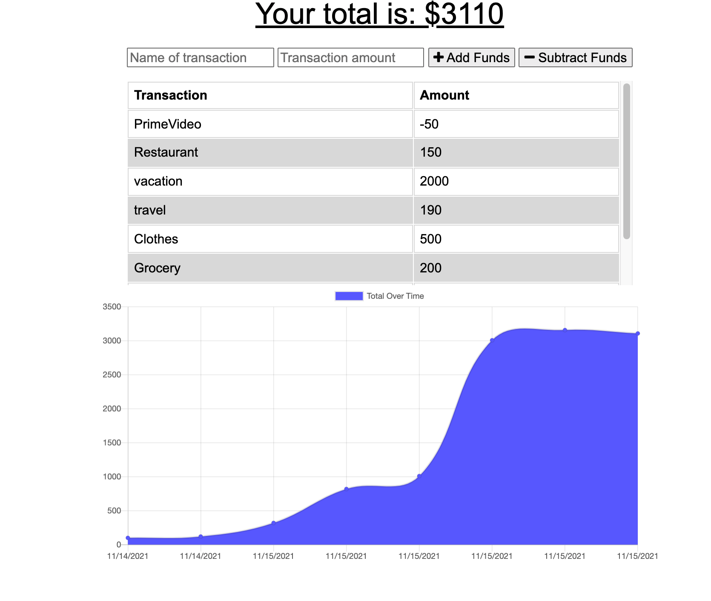
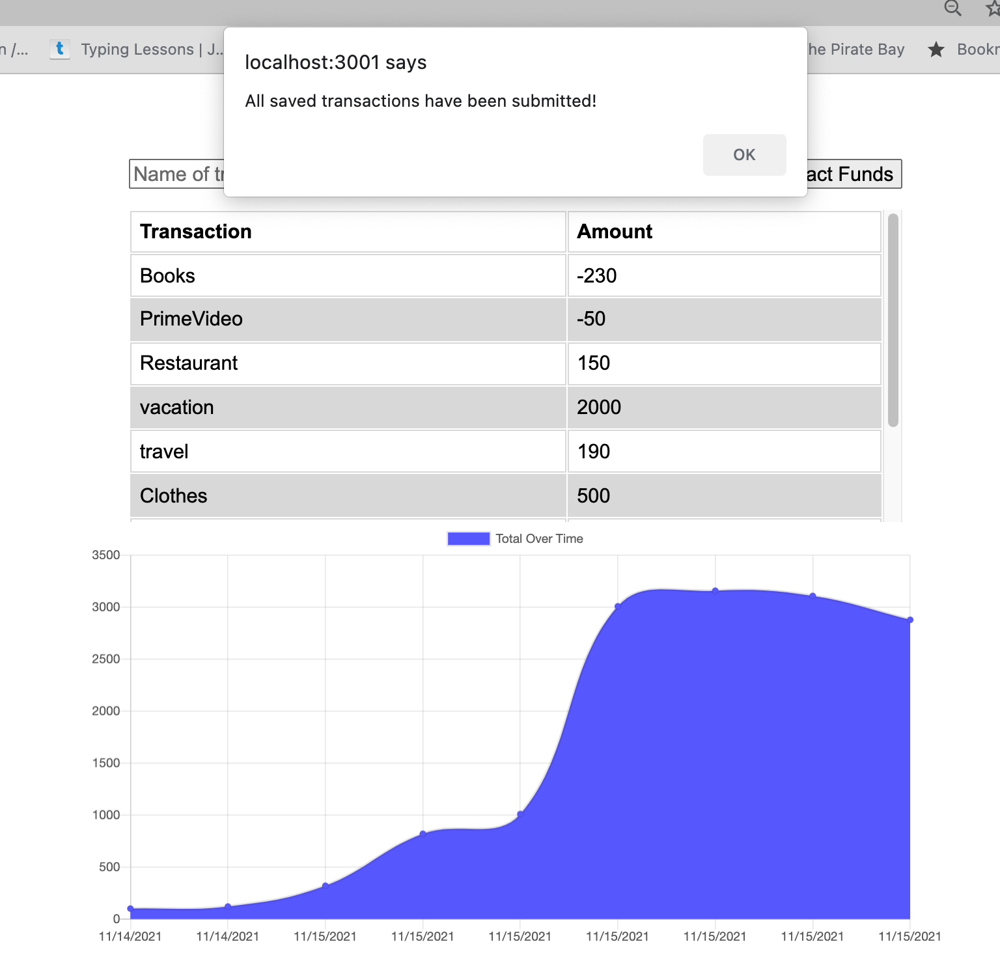

# budget-tracker

## [Heroku Deployed App Url](https://budget-tracker-99999.herokuapp.com/)

## [GitHub Url](https://github.com/harry-100/budget-tracker)

## Description

This is a simple budget tracking app which provides offline functionality to its users so that they can interact with the app and add their data even when offline. This is done by data persistence through indexedDb API. This app also uses service worker. 

## Table of Contents

* [Usage](#Usage)
* [License](#License)
* [ScreenShots](#ScreenShots)
* [Questions](#Questions)

## Usage
This app is deployed on heroku. It can be invoked by clicking on the url provided above. 

## License
This application is covered under [MIT](
      https://opensource.org/licenses/MIT
      ) license.

## ScreenShots

## Questions
If you need more information, please checkout my [github account](https://github.com/harry-100). You can also reach me via [email](mailto:harvinder.shah@gmail.com?subject=budget-tracker).
